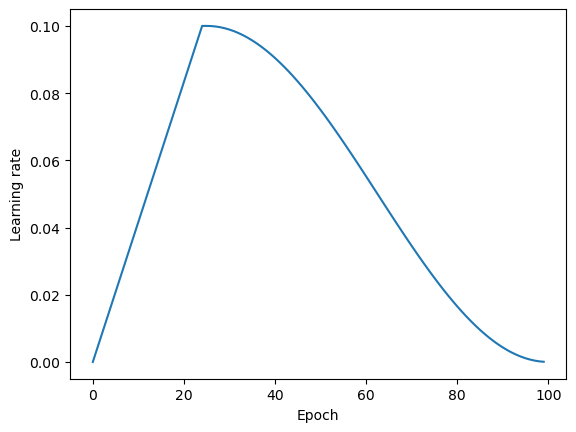

# Exercise 1: Learning Rate Warmup

This exercise asks you to experiment with learning rate warmup during cosine annealing.

Learning rate warmup is a technique that involves gradually increasing the learning rate from a small value to a larger target value over a certain number of iterations or epochs. Learning rate warmup has empirically been shown to stabilize training and improve convergence.

In this notebook, we are adapting the [cosine annealing code from Unit 6.2 Part 5](https://github.com/Lightning-AI/dl-fundamentals/blob/main/unit06-dl-tips/6.2-learning-rates/6.2-part5-3-scheduler-cosine.ipynb). 

In particular, your task is to replace the `torch.optim.lr_scheduler.CosineAnnealingLR` scheduler with a similar scheduler that supports warmup. For this, we are going to use the 
 `LinearWarmupCosineAnnealingLR` class from the PyTorch Lightning Bolts library, which can be installed via 

    pip install lightning-bolts

And you can find more about the `LinearWarmupCosineAnnealingLR` usage in the [documentation here](https://pytorch-lightning-bolts.readthedocs.io/en/latest/schedulers/warmup_cosine_annealing.html)

Note that you can use the accompanying notebook as a template and fill in the marked blanks. If you use a schedule similar to the one shown in the image below, you should get ~89% accuracy.

